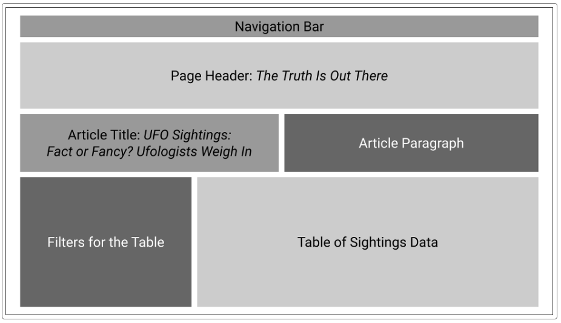
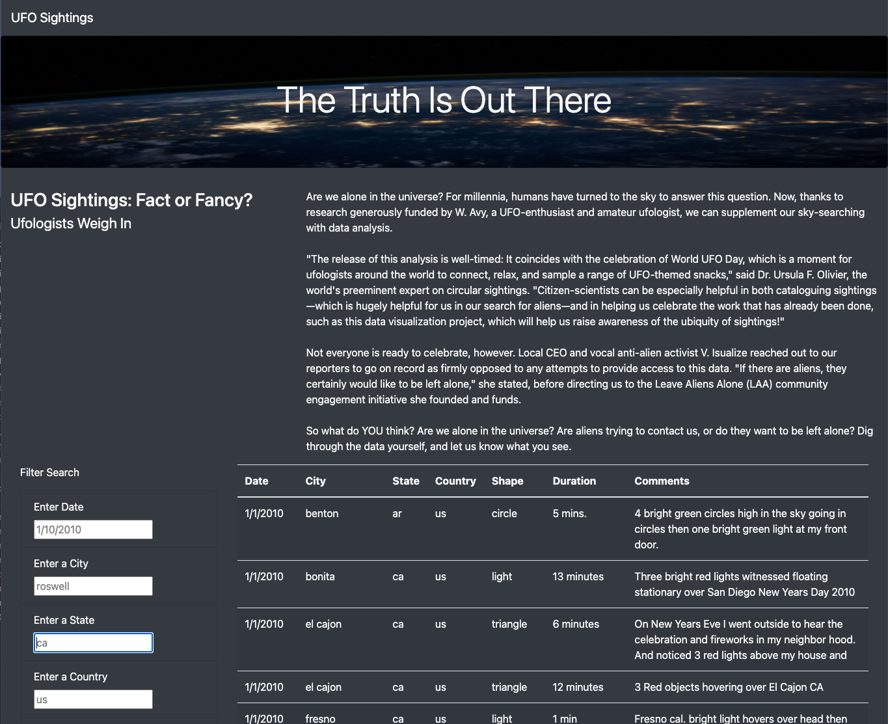
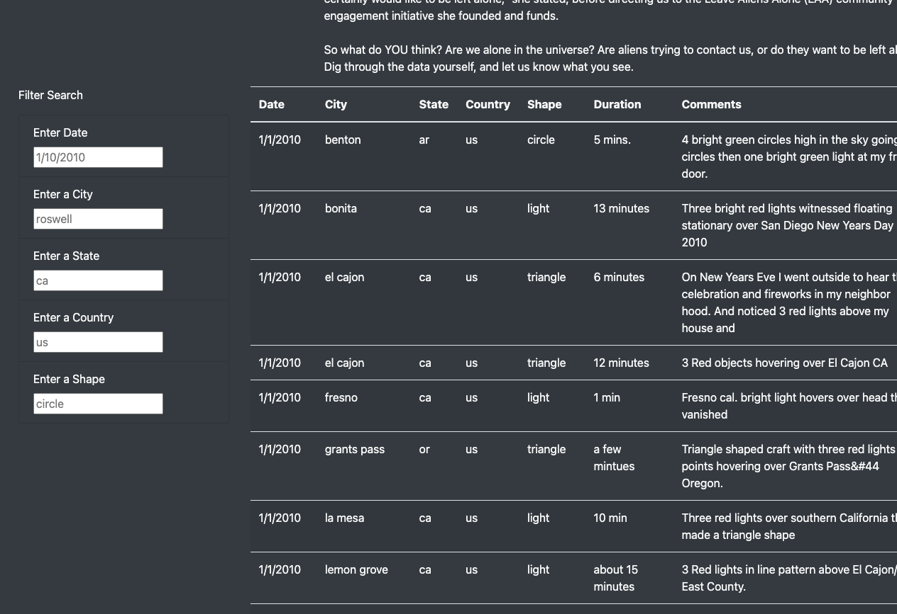
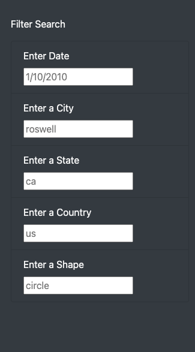
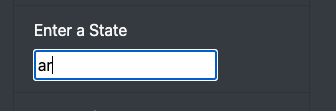
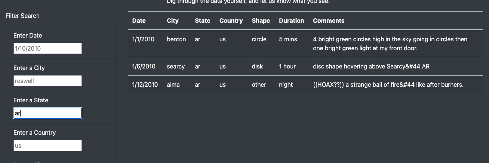

# UFO Analysis
Dynamic data table application using JavaScript, HTML, and Bootstrap

## Overview
Unidentified Flying Objects (UFOs) are a topic of much debate and controversy. UFO sightings begs questions such as: “Are there sophisticated lifeforms out in the universe who are coming to visit Earth, and if so what are their intentions?” 

The purpose of this project was to construct a web based, dynamic data table of UFO sighting data using JavaScript, HTM, CSS, and Bootstrap. Additionally, the table was to be built with the ability to filter data based on sighting date, city, state, country, and UFO shape.

## Resources
  * Javascript
  * HTML
  * Bootstrap
  * CSS
  * VS Code
  * Google Chrome DevTools

## Process Summary:

First, a storyboard was sketched out to plan the layout of the webpage. The storyboard would provide an idea of what users would see when they view the final product. Next, the data was imported with JavaScript and pointed to the HTML page with the tbody HTML tag using D3. Next, dynamic functionality was built into the table using JavaScript for loops and functions. Next, the HTML file was updated with the data filtering functionality as well as script tags. Finally, the HTML was customized with Bootstrap and CSS to optimize the web page aesthetics. 

Figure 1. Storyboarding

Figure 2. Production Page

# Using the UFO Sighting Tool
Follow these instructions to investigate the UFO sighting database.  The screenshots below provide visual examples. 

  * Scroll to the filter input elements on the left hand side of the page
  * Choose a filter variable type
  * Enter desired filter criteria and press enter or return on your keyboard
  * View the table for the list of sightings returned based on the filter criteria entered

Find the filter

Filter variable types

Enter criteria

View returned data

# Summary

In summary, this website provides an easy to use, interactive website that allows users to sift through a large amount of data very quickly. Although the layout is clean and aesthetic and the mechanics of filtering the data is very intuitive, one drawback is that the actual information produced is limited. 

Recommendations for further development are as follows. Although filtering the data is relatively simple, it could potentially be improved by adding a ‘search’ button. This may make it more clear to the user when and how the search functionality is initiated. Another improvement could be to enrich the data by providing a link to an article about each sighting if available. Additionally, the page could be improved by adding download or print functionality so that a user could extract their search results for use outside of the web application. 

